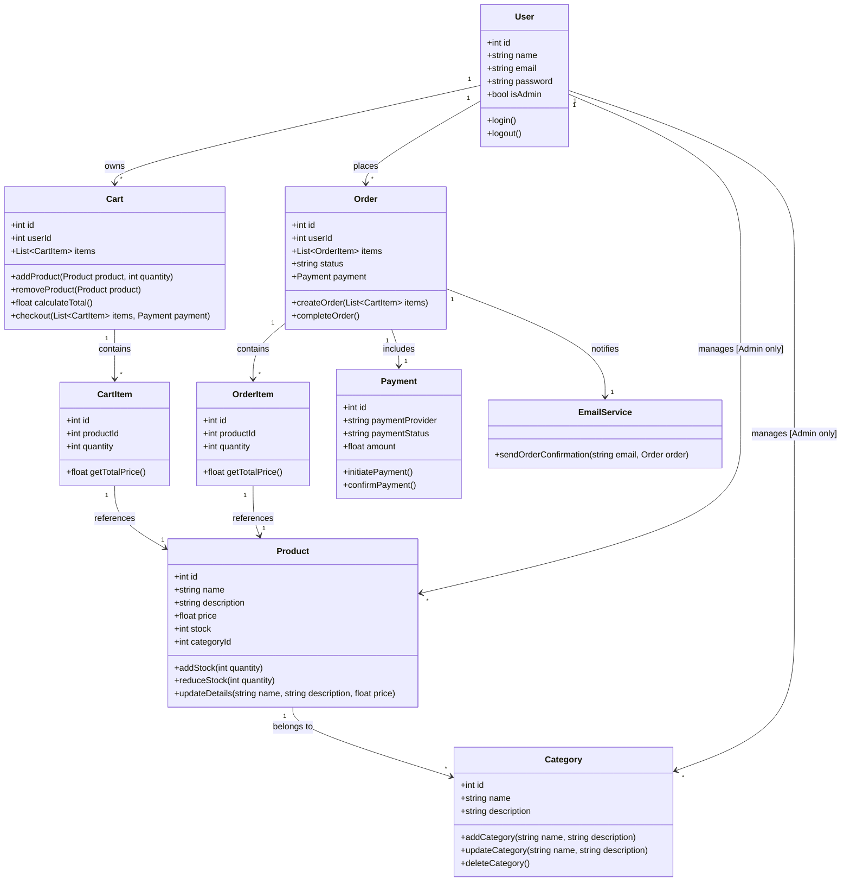

This is a [Next.js](https://nextjs.org) project bootstrapped with [`create-next-app`](https://nextjs.org/docs/app/api-reference/cli/create-next-app).

## Getting Started

First, run the development server:

```bash
npm run dev
# or
yarn dev
# or
pnpm dev
# or
bun dev
```

Open [http://localhost:3000](http://localhost:3000) with your browser to see the result.

You can start editing the page by modifying `app/page.tsx`. The page auto-updates as you edit the file.

This project uses [`next/font`](https://nextjs.org/docs/app/building-your-application/optimizing/fonts) to automatically optimize and load [Geist](https://vercel.com/font), a new font family for Vercel.

## Learn More

To learn more about Next.js, take a look at the following resources:

- [Next.js Documentation](https://nextjs.org/docs) - learn about Next.js features and API.
- [Learn Next.js](https://nextjs.org/learn) - an interactive Next.js tutorial.

You can check out [the Next.js GitHub repository](https://github.com/vercel/next.js) - your feedback and contributions are welcome!

## Deploy on Vercel

The easiest way to deploy your Next.js app is to use the [Vercel Platform](https://vercel.com/new?utm_medium=default-template&filter=next.js&utm_source=create-next-app&utm_campaign=create-next-app-readme) from the creators of Next.js.

Check out our [Next.js deployment documentation](https://nextjs.org/docs/app/building-your-application/deploying) for more details.

- (https://github.com/vercel/nextjs-postgres-nextauth-tailwindcss-template)[https://github.com/vercel/nextjs-postgres-nextauth-tailwindcss-template]
- (https://github.com/vercel/commerce)[https://github.com/vercel/commerce]
- (https://dev.to/bespoyasov/clean-architecture-on-frontend-4311)[https://dev.to/bespoyasov/clean-architecture-on-frontend-4311]
- (https://profy.dev/article/react-architecture-api-client)[https://profy.dev/article/react-architecture-api-client]

- [ ] 모든 사용자는 로그인, 로그아웃할 수 있다.
- [ ] 관리자 기능은 관리자만 접근할 수 있다.
- [ ] 관리자는 카테고리를 추가, 업데이트, 삭제할 수 있다.
- [ ] 관리자는 상품을 추가, 업데이트, 삭제할 수 있다.
- [ ] 사용자는 상품을 카트에 추가, 업데이트, 삭제할 수 있다.
- [ ] 사용자는 상품을 바로 구매하거나 카트에 담긴 상품의 일부 또는 전체를 구매할 수 있다.
- [ ] 상품 주문 시 결제는 stripe를 사용하여 결제한다.
- [ ] 결제가 완료되어 주문이 끝나면 사용자 이메일로 주문 정보를 보낸다.
- [ ] 구매한 상품에 대해서는 장바구니에서 삭제되어야 한다.


